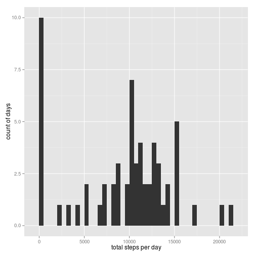
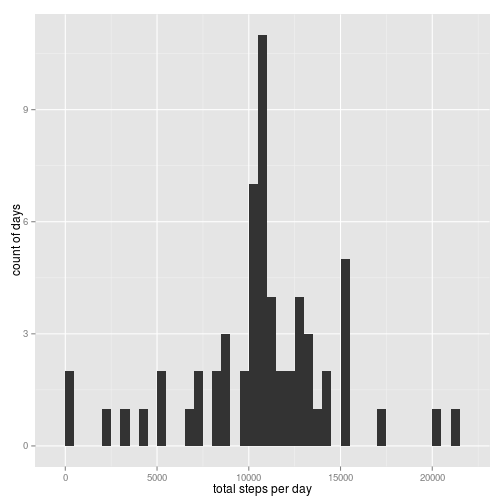
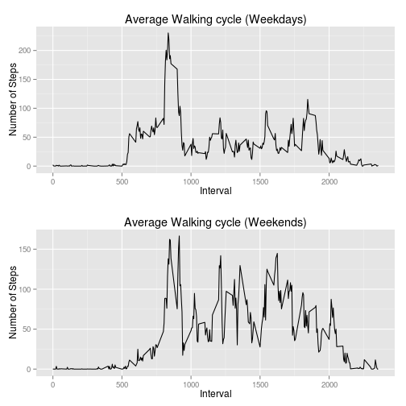

# Reproducible Research: Peer Assessment 1

## Background
In this assignment,
we will examine two months of activity data
for a single anonymized user, 
using the provided dataset,
[activity.zip](https://d396qusza40orc.cloudfront.net/repdata%2Fdata%2Factivity.zip "activity.zip")

## Loading and preprocessing the data
First we will load the the data.
Since the data is fairly regular,
we will not do any processing up front,
and will defer any summerization until 
we analyze the data.and summarize it by day,
simply ignoring any NA values.

```r
data <- read.csv(unz('activity.zip', 'activity.csv'))
```
## What is mean total number of steps taken per day?
To look at the data on a day over day basis,
well start by summarizing the data by totaling
the number of steps in each day, 
initially ignoring any missing values.


```r
library(plyr)
daily <- ddply(data, c('date'), summarize,
               total=sum(steps, na.rm=TRUE))
mean_steps = mean(daily$total)
median_steps = median(daily$total)
max_steps = max(daily$total)
min_steps = min(daily$total)
```

If we look at the summary data, 
we see that the mean number of steps per day is 9354.2295082
and the median is 10395.
Both are approximately 10 thousand.
However, if we look at a histogram, we see steps per day
can vary widely, from 0 to 21194.


```r
library(ggplot2)
ggplot(daily, aes(x=total)) +
  geom_histogram(binwidth=500) +
  labs(x='total steps per day') +
  labs(y='count of days') 
```

 

## What is the average daily activity pattern?
To examine the daily pattern, we can aggregate the data 
by time slice in the data,
computing the average number of steps taken for that interval.
Again we'll initially just ignore missing values.


```r
diurnal <- ddply(data, c('interval'), summarize, 
                 mean_steps=mean(steps, na.rm=TRUE))
peak_steps <- max(diurnal$mean_steps)
peak_interval <- diurnal[diurnal$mean_steps == peak_steps,]["interval"]
```

Now we can examine the daily pattern, 
comparing the average number of steps in each
interval, averaged over the two months


```r
ggplot(diurnal, aes(x=interval, y=mean_steps)) +
  geom_line() +
  labs(x="Interval") +
  labs(y="Number of Steps")
```

 

And we notice that the largest average number of steps
per 5 minute period is 206.1698113 in interval 835.

## Imputing missing values


```r
na_rows <- length(which(is.na(data$steps)))
total_rows <- length(data$steps)
```
One potential flaw in the data set is missing values.
Of the 17568 rows, 2304 have missing step values.
There are any number of potential strategies
for imputing the missing data.
Here, we'll take a simple strategy:
 * assuming that missing data is simply missing,
   that is that it is lost data and not actual inactivity
   with no steps,
 * that all days are mostly the same,
   so it's basically fair to substitute the mean
   value for that interval.


```r
data$mean <- rep(diurnal$mean_steps,times=61)
data$steps[is.na(data$steps)] <- data$mean[is.na(data$steps)]
```

To understand how this may effect our analysis,
we can redo our initial analysis,
summing over the days, 
computing the means and medians
and examining the distribution of steps per day


```r
daily2 <- ddply(data, c('date'), summarize,
               total=sum(steps, na.rm=TRUE))
mean_steps2 = mean(daily2$total)
median_steps2 = median(daily2$total)
max_steps2 = max(daily2$total)
min_steps2 = min(daily2$total)
```
With the imputed data, we now have a mean of 1.0766189 &times; 10<sup>4</sup>
compared to the original 9354.2295082
and a median of 1.0766189 &times; 10<sup>4</sup> compared to 10395.

Looking at the distribution we see


```r
ggplot(daily2, aes(x=total)) +
  geom_histogram(binwidth=500) +
  labs(x='total steps per day') +
  labs(y='count of days') 
```

 

So, we see that we have raised the mean and median slightly,
while ensuring that the median approaches the mean.
Overall we show much less of a skew towards low values,
i.e. those under 500 steps per day,
and a stronger weighting towards the mean.
The resulting data more closely approximates a 
normal distribution, which makes it feel
that we have fixed more than we've broken by imputing the data.

## Are there differences in activity patterns between weekdays and weekends?

First, we need tag our data
by examining the data and marking it was either 
on a weekend, i.e. Saturday or Sunday, or a weekday.
Then we can average steps per 5 minutes over each time interval 
independently on each subset 
to compare the weekday and weekend walking patterns.


```r
weekend <- c('Sat', 'Sun')
data$weekend <- ifelse(weekdays(as.Date(data$date), 
                                abbreviate=TRUE) %in% weekend,
                       'weekend', 'weekday')
weekday_cycle <- ddply(subset(data, weekend=='weekday'),
                       c('interval'), summarize, steps=mean(steps))
weekend_cycle <- ddply(subset(data, weekend=='weekend'),
                       c('interval'), summarize, steps=mean(steps))
p1 <- ggplot(weekday_cycle, aes(x=interval, y=steps)) +
  geom_line() +
  labs(x="Interval") +
  labs(y="Number of Steps") +
  ggtitle("Average Walking cycle (Weekdays)")
p2 <- ggplot(weekend_cycle, aes(x=interval, y=steps)) +
  geom_line() +
  labs(x="Interval") +
  labs(y="Number of Steps") +
  ggtitle("Average Walking cycle (Weekends)")
library(grid)
library(gridExtra)
grid.arrange(p1, p2, ncol=1)
```

 

Examining the two graphs,
we see that the weekday and weekend cycles are quite different.
Both subsets exhibit periods of relative inactivity,
presumably while sleeping at night.
But the weekend activity is spread more evenly
over the day, without as much of a spike at about 700,
and starts later.
Like as not the subject got to sleep in a bit on the weekends
and then got to go out during the day,
rather than being tied to a desk.
Of course, that reasoning is pure guesswork,
as the data was anonomized and we know nothing about the subject
whose data was chosen for this exercise.
